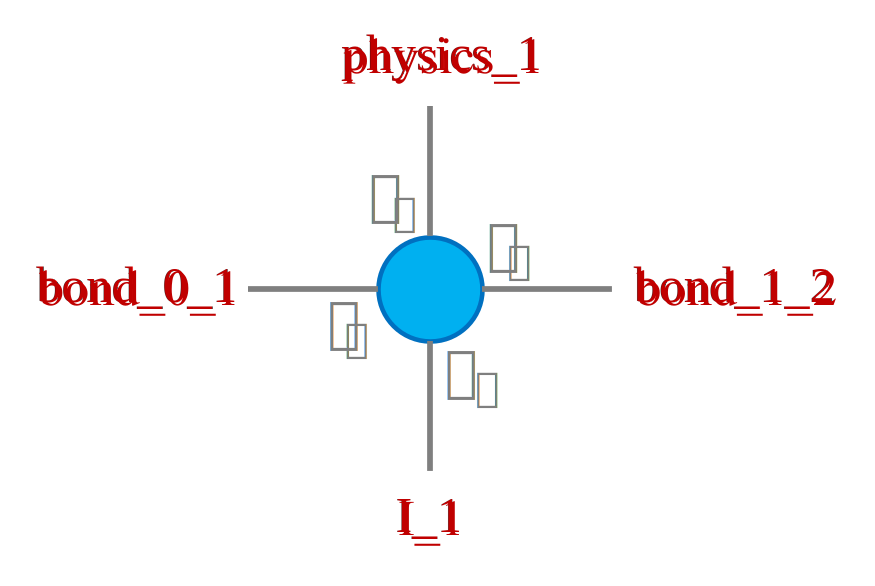
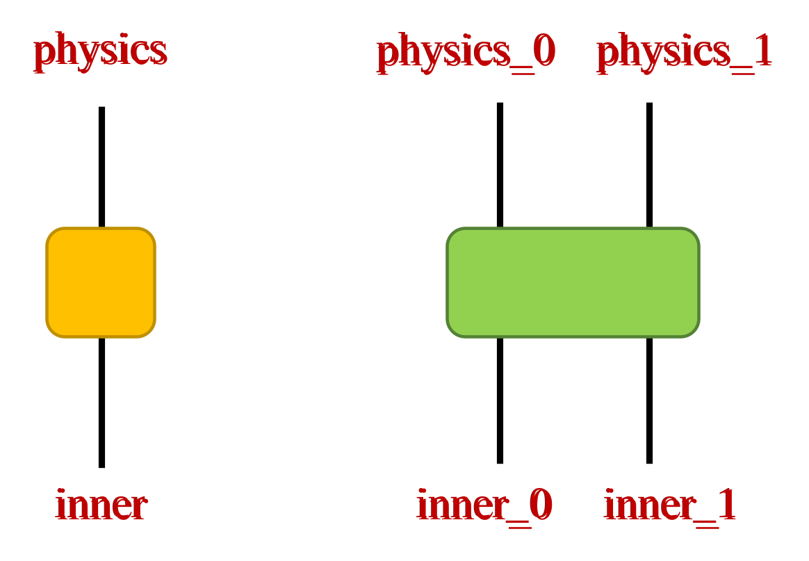
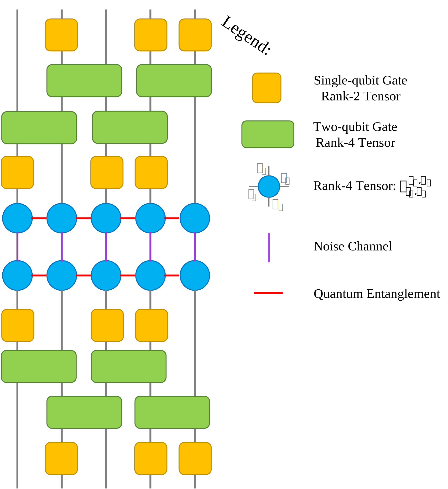
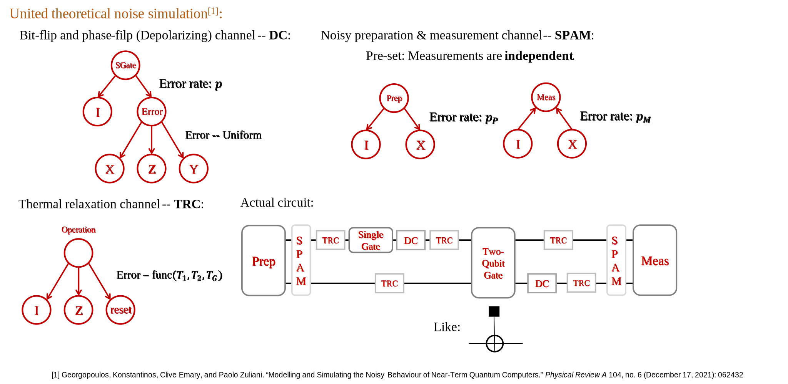
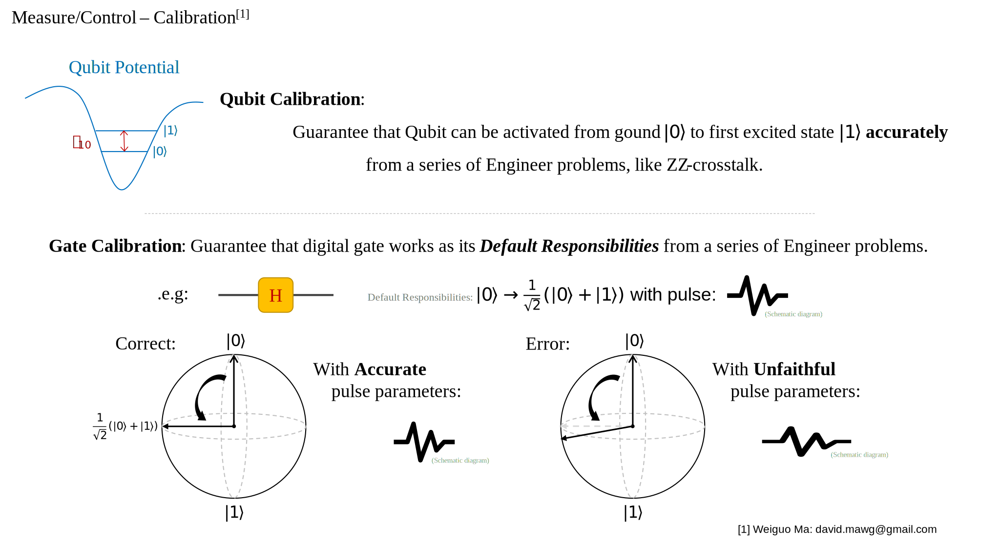
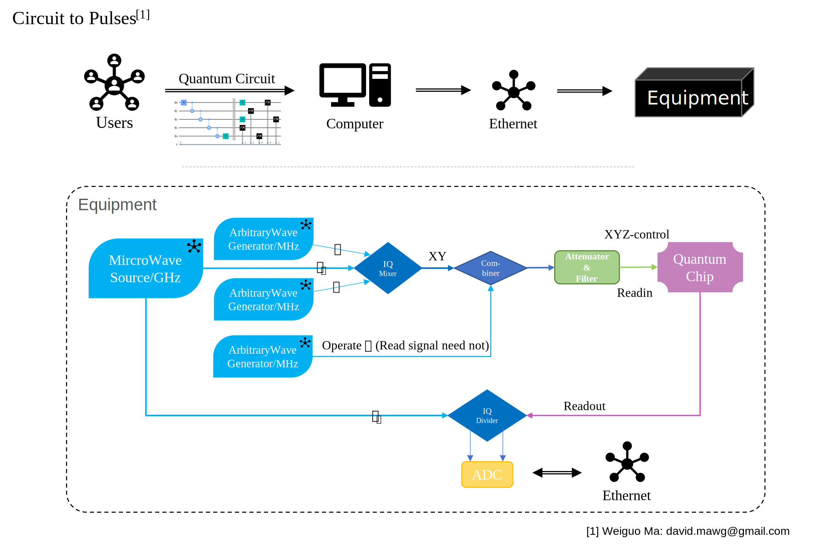

# Noisy Quantum circuit simulator with Matrix Product Density Operator (MPDO)

###### I have to emphasize that this project is not intended for High Performance Computing now.
###### The python version, especially based on Pytorch, could be orders of magnitude slower than the C++ implementation.
###### The C++ version, with ITensor package, is not uploaded yet.
This work contains the code of paper "Tomography-assisted noisy quantum circuit simulator using matrix 
product density operators". This work simply combines the Quantum Process Tomography with Matrix Product 
Density Operators to simulate the quantum circuit with experimental "real noise". The manuscript can be 
found here: [https://journals.aps.org/pra/abstract/10.1103/PhysRevA.110.032604](https://journals.aps.org/pra/abstract/10.1103/PhysRevA.110.032604).
## Computer Implementation

Main Packages Required:

- TensorNetwork -- Latest Version
- Pytorch -- Version 2.0 or Version 1.10

### TensorNetwork Package
###### Because of the design from old version PyTorch, You need to substitute the decompositions.py file in TensorNetwork.backend.torch to reach the correct SVD and QR decomposition.

The project centers around TensorNetwork, a mathematical methodology capable of performing truncation to
expedite calculations while maintaining a constrained level of error, a phenomenon introduced through Singular
Value Decomposition (SVD).

The chosen software tool employed for TensorNetwork calculations is the Python package named "TensorNetwork,"
accessible at [https://github.com/google/TensorNetwork](https://github.com/google/TensorNetwork). This package
boasts multiple backends, including Jax, Pytorch, Tensorflow, Numpy, and others. It is essential to note that,
as of the last update in 2021, the package is in an alpha version and no longer receives regular updates.
Within the context of this project, the PyTorch backend was adopted and configured accordingly.

```
tensornetwork.set_default_backend("pytorch")
```

Potential issues may arise when utilizing this package, necessitating self-implemented code fixes. The primary
reason for selecting this particular package is its simplicity and ease of comprehension, especially
considering that it was the first package I encountered through NEW Bing. Due to my limited coding
proficiency, I opted not to explore alternative packages at this time. The problems encountered include, but
are not limited to:

1. Axis_names and edge_names are not consistent, which may cause bugs like in
   SVD (Interestingly
   , edges name won't change after operation like CONTRACT, so I wrote function
   tools.EdgeName2AxisName
   to keep axis_names is right);
2. Some of the backends' settings are out of date, like torch.svd and torch.qr are substituted by
   torch.linalg.svd and torch.linalg.qr, and may causes bug while .linalg.svd
   return vh, which
   is the transpose and conjugate of v, but .svd return v directly;
3. ...

Certainly, there are packages under maintenance,

- [TeNpy](https://github.com/tenpy/tenpy): A package developed by physicist, it
  provides
  many useful algorithm like DMRG/TEBD, but it is not easy to use(for me);
- [ITensor](https://itensor.org/): If you're familiar with C++ or Julia, ITensor
  is a good
  choice to accomplish the target.
- You might just create a package with different backend, use backend.einsum()
  to make
  calculation.

<span style="color:red">
For all, author(me) is not familiar with both C++ and TensorNetwork coding, so I choose
the simplest one as a startup. Once the MPS-MPO-MPDO simulator is necessary for me and my
team, I might consider coding it with CPP with a faster contracting and controlling. Let it
be known that ** ITensor does not support its CPP package **.
</span> 


**Attention:**

1. While you are trying to use spilt_node(svd or qr), be careful about the
   axis_names, which is involved in the calculation of the SVD/QR with left_edges and right_edges,
   I wrote some strategy to ensure it is right, but might be ugly, and some of them are abolished.
2. I set **Nodes** as qubits, which can be easily operated and more intuitive to understand. However, in
   some theory, people believe that **Edges** are qubits, which is more suitable.
3. Python Class tensornetwork.Node or tensornetwork.AbstractNode is physical entity in computer memory, so
   that operations to qubits can be done without given a new memory space, which saves memory and easy to
   code in implementation.

### Qubit

A qubit serves as the fundamental unit in quantum computing, representing a two-level quantum system. In the
context of this project, I employ "tn.Node" or "tn.AbstractNode" as qubits, which can be dynamically adjusted
in
rank through contraction.

**Attention:** Axis_names is an important property in TensorNetwork Package, which is a list in python, it
easily makes mistakes. In this project, I have designed a general high-rank qubit/tensor representation for
the current model of quantum computing. The qubit/tensor structure is depicted in the picture below:

<p align="center">

</p>

Noticed that the indices name is explicit with number of qubit, for 1st qubit, it has name in pic.

### Quantum Gate

Quantum Gates are commonly defined as matrices; however, in tensornetwork, they are treated as tensors, which
represent a generalization of matrices. From a conceptual standpoint, a single-qubit gate like 'X' can be
represented as a 2x2 matrix, which corresponds to a (2, 2) rank-2 tensor. Similarly, a multi-qubit gate like '
CNOT' is typically represented as a 4x4 matrix, which can be equivalently represented as a (2, 2, 2, 2) rank-4
tensor.

I have developed a class named TensorGate() within the file basic_gate.py. This class includes fundamental
quantum gates, each possessing properties such as name, tensor, rank, shape, axis_names, and others.

**Attention:** Axis_names is an important property in TensorNetwork Package, which is a list in python, it
easily makes mistakes. I have designed the TensorGate() class to handle gates/tensors, as depicted in the
picture below. The class is readily extensible to accommodate many-qubit gates, providing a versatile and
scalable solution.

<p align="center">

</p>

Currently, I provided basic gates
as: ['X', 'Y', 'Z', 'H', 'S', 'T', 'RX', 'RY', 'RZ', 'U1', 'U2',
'U3', 'U', 'CNOT', 'CZ', 'SWAP', 'RZZ']. Their tensor form is formed with
function
**torch.reshape()**, except CNOT, which tensor is derived from its truth table.

## Physics Implementation

Adding quantum gates to qubits is the basic operation in quantum computing, and it's naturally to be show
in tensornetwork form like picture below.

<p align="center">

</p>

Quantum entanglement between qubits stands as a pivotal aspect of quantum computing, primarily facilitated by
many-qubit gates. It bestows upon qubits/tensors an additional degree of freedom to coexist. Employing
tensornetwork to represent quantum circuits is primarily motivated by its efficient contraction strategy.
While observing the outcomes of a quantum circuit, one typically obtains a probability distribution rather
than an explicit series of nodes. Unfortunately, attempting to contract all operated nodes simultaneously can
lead to an exponential explosion of computational resources. To mitigate this issue, tensornetwork technique
offers various contraction algorithms, such as DMRG, which leverage the truncation feature of the SVD function
to accelerate calculations. Consequently, when implementing the addition of quantum gates, I have adopted a
strategy to limit the dimension of bonds between entangled qubits, thereby ensuring computational tractability
and enhancing the overall efficiency of the quantum circuit representation.

1. Do a local optimal approximation on inner indices by SVD, which is (this part
   is introduced
   by quantum noise, and I'll show it later).

```math
    T_{l_k, r_k}^{s_k, a_k} = \sum_\mu U^{s_k, \mu}_{l_k, r_k} S_\mu V_{\mu, a_k}
```

Keep $\kappa$ largest singular values $S_\mu$ after a layer of noise.

2. Apply QR-decomposition on each Tensor from left to right (which forms a
   canonical form of MPO),

```math
    T_{l_k, r_k}^{s_k, a_k} = \sum_\mu Q^{s_k, a_k}_{l_k, \mu} R_{\mu, r_k}
```

Except the rightest tensor, all other tensors got left-orthogonalized.

3. Apply SVD from right to left to truncate each of the bond indices,

```math
    \sum_ {l_ {k+1}} T_ {l_k, l_ {k+1}}^{s_k, a_k} T_ {l_ {k+1}, r_ {k+1}}^{s_ {k+1}, a_ {k+1}}\approx 
    \sum_ {\mu=1}^{\chi} U^{s_k, a_k}_ {l_k, \mu} S_\mu V_ {\mu, r_ {k+1}}^{s_ {k+1}, a_ {k+1}}
```

<span style="color:blue">
The most economical way is first to complete a layer of two-qubit gates and noise, then
to perform step 2&3.
</span>

## Mathematical Implementation

Indeed, in traditional matrix operations, when applying a double-qubit gate to qubits that are non-adjacent (
stepping over other qubits), SWAP gates or permutation operations are typically required to control the matrix
elements appropriately.

However, in the context of tensornetwork, such extra steps are not necessary. This advantage arises because
the tensor representation of quantum gates operates within subspaces, each associated with "legs" that
correspond to qubits. By intelligently choosing the right legs to contract with the relevant qubits, it
becomes possible to perform the operation directly without any need for permutation or SWAP gates. This
streamlined approach is one of the key benefits of using tensornetwork to represent quantum circuits, as it
simplifies computations and minimizes the overhead typically associated with non-adjacent qubit interactions.

<p align="center">

</p>

And the entanglement are naturally to be spread between qubits with following operations.

# Inplementation of Quantum Noise

## Unified Theoretical Noise Model

Quantum noise is a complex and essential aspect of quantum physics. Within the realm of quantum computation,
it can be categorized into various types or channels, two of which are amplitude damping and phase damping, as
illustrated in the diagram below:

<p align="center">

</p>

Amplitude damping refers to the loss of quantum information due to interactions with the environment, leading
to a decrease in the probability of the quantum state's amplitude. Phase damping, on the other hand, involves
the random introduction of phase errors, which alters the quantum state's phase information.

These quantum noise phenomena play a crucial role in the performance and reliability of quantum computations,
necessitating thorough understanding and mitigation strategies in quantum algorithms and quantum error
correction techniques.

Indeed, detailed quantum noise simulation and various noise channels can be found in books and research papers
on quantum computing and quantum information, such as "Quantum Computation and Quantum Information" (QCQI) by
Nielsen and Chuang. The implementation of quantum noise in quantum circuits often involves considering various
noise models and applying appropriate noise channels to simulate realistic quantum systems. The Actual circuit
in the picture likely represents a specific quantum circuit with quantum noise included, where some noise
channels are applied to the qubits.

Moreover, it is true that accounting for state preparation and measurement (SPAM) errors can be more
challenging, as they are typically associated with lower probabilities. In practice, researchers often focus
on the dominant noise sources and their impact on the quantum computation, while accounting for SPAM errors
when necessary.

## Real Noise (based on Experimental Data - $\chi$ Matrix)

A **TRUE** quantum noise simulation function with the QPT-Chi matrix on **REAL**
quantum
computer CZ-gate is provided. A real quantum noise takes places in actual
physical
control of the superconducting qubits, two examples are shown in picture below,

<p align="center">

</p>

## Experimentation System

You might be curious of the pulse-controlled quantum computing system, a sketch
is shown below,

<p align="center">

</p>

# Structure of the Project

The project structure appears to be well-organized and modular. Below is a brief description of each component
in the project:

- `main`: This file serves as a test file for the project, ensuring that the environment is correctly set up.

**Library**:

- `QuantumGate`: This abstract class defines the interface for quantum gates, providing a blueprint for
  implementing different types of quantum gates.

- `AbstractCircuit`: AbstractCircuit is an abstract class that defines the interface for quantum circuits,
  providing a blueprint for implementing different types of quantum circuits.
- 
- `QuantumCircuit`: TensorCircuit is a concrete class that implements the AbstractCircuit interface, providing
  a blueprint for implementing different types of quantum circuits.

- `chipInfo`: This module offers fundamental information about quantum chips, which is primarily used for
  noise simulation in the context of quantum computation.

- `NoiseChannel`: This module provides noise channels for the quantum circuit, allowing the simulation of
  realistic quantum noise during computations.

- `TNNOptimizer`: This class implements an optimizer for tensornetwork algorithms, likely aimed at optimizing
  the contraction strategy to enhance computational efficiency.

- `tools`: This module introduces a set of tools to facilitate various operations within the program or
  interface with external programs for specific functionalities.

Overall, this structure seems to adhere to good software engineering practices, promoting modularity and
reusability of components, which can lead to a more maintainable and scalable project.

# Tutorial

[Basic API Tutorial](https://colab.research.google.com/drive/1Fp9DolkPT-P_Dkg_s9PLbTOKSq64EVSu)

## Initialize Program

```python
import tensornetwork as tn

import Library.tools as tools
from Library.QuantumCircuit import TensorCircuit

tn.set_default_backend("pytorch")
```

## Basic Information of Quantum Circuit

```python
# Basic information of circuit
qnumber = 5
ideal_circuit = False  # or True
noiseType = 'realNoise'  # or 'realNoise' or 'idealNoise'

chiFileNames = {
    'CZ': {'01': './data/chi/czDefault.mat', '12': './data/chi/czDefault.mat', '23': './data/chi/czDefault.mat',
           '34': './data/chi/czDefault.mat'},
    'CP': {}
}
chi, kappa = 4, 4

"""
While ideal_circuit is False, simulator is working with a noisy quantum circuit with United Noise Model;
      realNoise is True, double-qubit gate is replaced by a real quantum gate with QPT-Chi matrix decomposition;
      
      chiFilename is the path of QPT-Chi matrix, which is used for real quantum noise simulation;
        I provided two chi matrix in ./data/chi, 'czDefault.mat' is for noise qubit,
                                                 'ideal_cz.mat' is ideal cz-gate chi matrix;
      
      chi is used for truncating the dimension between qubits in TNN_optimization process, accelerating the contraction;
      
      kappa is used for truncating the inner dimension between qubit-conj_qubit in contracting MPDO->DensityMatrix,
        let it be know that the KEY point in MPDO method is its representation of noise, while kappa=1, noise information
        is aborted, which means the so-called noise-simulation is not working exactly.
        
An ideal=True circuit cannot work with realNoise=True,
"""
```

## Establish a Quantum Circuit

```python
# Establish a quantum circuit
circuit = TensorCircuit(qn=qnumber, ideal=ideal_circuit, noiseType=noiseType,
                        chiFileDict=chiFileNames, chi=chi, kappa=kappa, chip='worst4Test', device='cpu')

circuit.h(0)
circuit.cnot(0, 1)
circuit.cnot(1, 2)
circuit.cnot(2, 3)
circuit.cnot(3, 4)

# Set TensorNetwork Truncation
circuit.truncate()

print(circuit)

```

## An Initial Quantum State

```python
"""
In tools.py, I provide several initial state like,
        |00..00>: create_ket0Series(qnumber)        |11..11>: create_ket1Series(qnumber)
        |++..++>: create_ketPlusSeries(qnumber)     |--..--> create_ketMinusSeries(qnumber)
    Or a random/wanted state with,
        |**..**>: create_ketRandomSeries(qnumber, tensor)
Certainly, people can input an arbitrary state with 
        list[tensornetwork.Node] or list[tensornetwork.AbstractNode]
"""

initState = tools.create_ket0Series(qnumber)
```

## Calculate Ket-space and Density Matrix $\rho$

```python
"""
State returns a state vector for pure quantum state, or a density matrix.

    Args:
     	state_vector: bool, if True, return a state vector, else return a density matrix.
     	reduced_index: list, calculate the reduced density matrix with the given index qubit is reduced.
"""

state = circuit(state, state_vector=False, reduced_index=[])
```

# Problems may be encountered

**VQA** is not supported in this version, bugs still exist in the implementation
of forward()
and updating the parameters.

**Memory Overflow** is possible to happen while unknown error occurs in the
program.