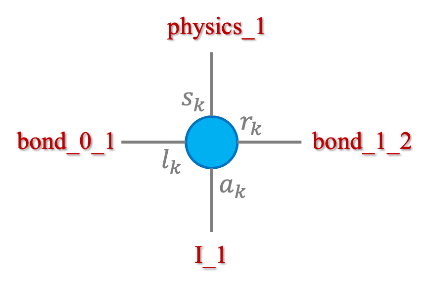
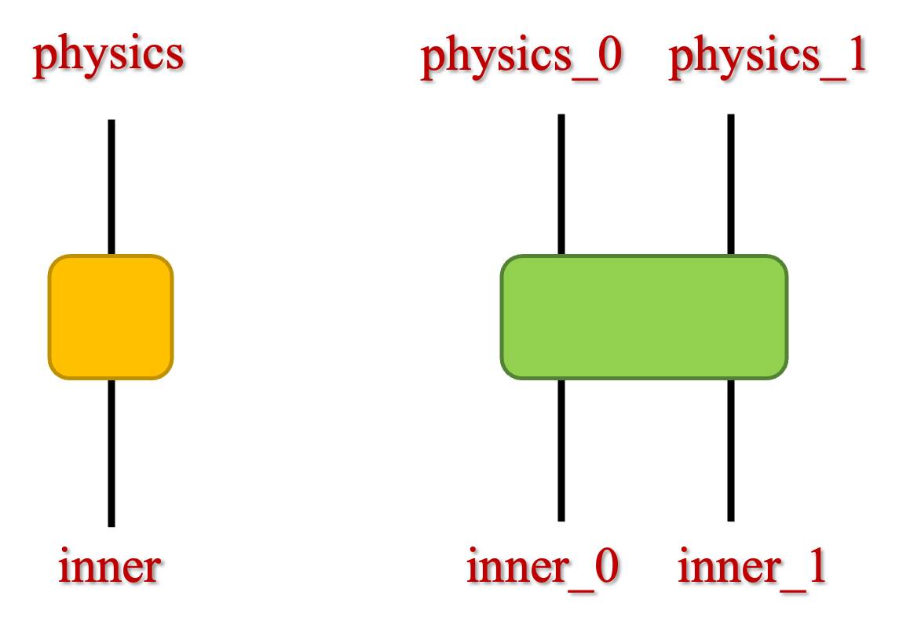
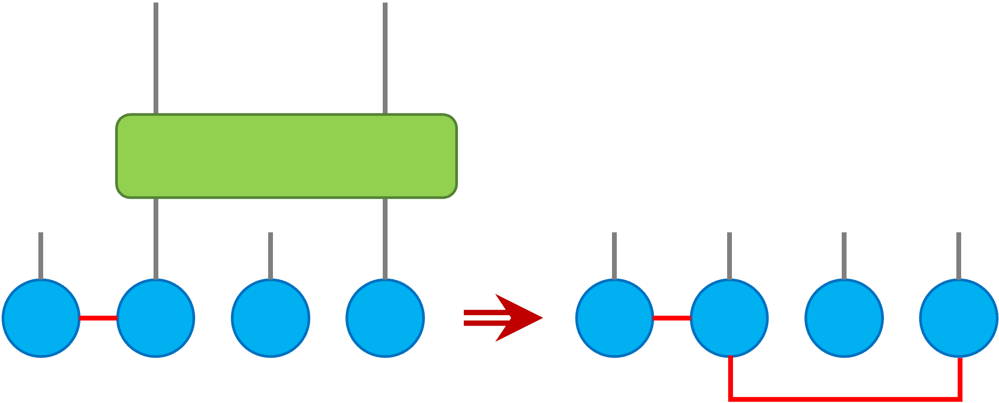

# Quantum circuit simulator with Matrix Product Density Operator (MPDO)

###### I have to emphasize that this project is not intended for High Performance Computing

## Computer Implementation

### TensorNetwork Package

Project is based on TensorNetwork, a mathematical technique that could do truncation to speed
up the calculation with limited error, which is introduced by SVD.

Package I used is TensorNetwork, which is a python package for tensornetwork calculations
from [google](https://github.com/google/TensorNetwork). This package gets multiple backends
like Jax, Pytorch, Tensorflow, Numpy, etc. However, this package is in alpha version, and 
stopped updating since 2021. I adopt backend as pytorch with setting 
    ```
    tensornetwork.set_default_backend("pytorch")
    ```

Problem may raise when using this package, some fixes are involve by me. I use this package
because of its simplicity and easy to read (actually this is the first package I know from NEW
Bing, and I just don't want to learn others, I am not good at coding). Problems like,

1. Axis_names and edge_names are not consistent, which may cause bugs like in SVD (Interestingly
, edges name won't change after operation like CONTRACT, so I wrote function tools.EdgeName2AxisName
to keep axis_names is right);
2. Some backends are out of date, like torch.svd and torch.qr are substituted by 
torch.linalg.svd and torch.linalg.qr, and may causes bug while .linalg.svd return vh, which
is the transpose and conjugate of v, but .svd return v directly;
3. ...

Certainly, there are packages under maintenance,
- [TeNpy](https://github.com/tenpy/tenpy): A package developed by physicist, it provides
many useful algorithm like DMRG/TEBD, but it is not easy to use(for me);
- [ITensor](https://itensor.org/): If you're familiar with C++ or Julia, ITensor is a good
choice to accomplish the target.
- You might just create a package with different backend, use backend.einsum() to make 
calculation.

<span style="color:red">
For all, author(me) is not familiar with both C++ and TensorNetwork coding, so I choose
the simplest one as a startup. Once the MPS-MPO-MPDO simulator is necessary for me and my
team, I might consider coding it with C++ with a faster contracting and controlling.
</span> 

**Attention:**
1. While you're trying to use spilt_node(svd or qr), be careful about the axis_names, which
is involved in the calculation of the SVD/QR with left_edges and right_edges, I wrote some
strategy to make sure it is right, but might be ugly, and some of them are abolished.
2. I set **Nodes** as qubits, which can be easily operated and more intuitive to understand.
However, in some theory, people believe that **Edges** are qubits, which is more suitable.
3. Python Class tensornetwork.Node or tensornetwork.AbstractNode is physical entity in 
computer memory, so that operations to qubits can be done without given a new memory space,
which saves memory and easy to code in implementation.

### Qubit
Qubit is a basic unit in quantum computing, which is a two-level system. In this project,
I use tn.Node or tn.AbstractNode as qubit, whose rank is changeable with contraction.

**Attention:** Axis_names is an important property in TensorNetwork Package, which is a list
in python, it easily makes mistakes. I designed it for qubit/tensor in picture below for a 
general high-rank situation in current model of quantum computing.

<p align="center">

</p>

Noticed that the indices name is explicit with number of qubit, for 1st qubit, it has name in pic.


### Quantum Gate
Quantum Gates are generally defined as a matrix, but in tensornetwork it is treated as tensor,
which is a generalization of matrix. From intuition, single-qubit gate like 'X' is a 2x2 matrix,
which can be represented as a (2, 2) rank-2 tensor, and multi-qubit gate like 'CNOT' is a 4x4 
matrix which can be represented as a (2, 2, 2, 2) rank-4 tensor. 

I make a Class called TensorGate() in file basic_gate.py, it contains some basic quantum gates
with property, like name, tensor, rank, shape, axis_names, etc. 

**Attention:** Axis_names is an important property in TensorNetwork Package, which is a list
in python, it easily makes mistakes. I designed it for gates/tensors in picture below, and
it's easy to be generalized to many-qubit gates.

<p align="center">

</p>

Currently, I provided basic gates as: ['X', 'Y', 'Z', 'H', 'S', 'T', 'RX', 'RY', 'RZ', 'U1', 'U2',
'U3', 'U', 'CNOT', 'CZ', 'SWAP', 'RZZ']. Their tensor form is formed with function 
**torch.reshape()**, except CNOT, which tensor is derived from its truth table.

## Physics Implementation

Adding quantum gates to qubits is the basic operation in quantum computing, and it's naturally
to be show in tensornetwork form like picture below.

<p align="center">

</p>

Quantum entanglement between qubits is the key to quantum computing, it's introduced by many-
qubit gates, it gives qubit/tensor a new leg to survive. The main idea to use tensornetwork to 
represents the quantum circuit is its contraction strategy. While people are spectating the result
of a quantum circuit, it gives a probability distribution but not a series of nodes. Hence, the
exponential disaster appear when people are trying to contract all the operated nodes together.
Tensornetwork provide a series of contraction algorithms like DMRG, whose main idea is utilizing
SVD function's truncation to speed up the calculation. Therefore, the implementation of adding 
quantum gates here, I take strategy below to limit the dimension of bond between entangled 
qubits.
1. Do a local optimal approximation on inner indices by SVD, which is (this part is introduced
by quantum noise, and I'll show it later).
```math
    T_{l_k, r_k}^{s_k, a_k} = \sum_\mu U^{s_k, \mu}_{l_k, r_k} S_\mu V_{\mu, a_k}
```
Keep $\kappa$ largest singular values $S_\mu$ after a layer of noise.
2. Apply QR-decomposition on each Tensor from left to right (which forms a canonical form of MPO),
```math
    T_{l_k, r_k}^{s_k, a_k} = \sum_\mu Q^{s_k, a_k}_{l_k, \mu} R_{\mu, r_k}
```
Except the rightest tensor, all other tensors got left-orthogonalized.
3. Apply SVD from right to left to truncate each of the bond indices,
```math
    \sum_ {l_ {k+1}} T_ {l_k, l_ {k+1}}^{s_k, a_k} T_ {l_ {k+1}, r_ {k+1}}^{s_ {k+1}, a_ {k+1}}\approx 
    \sum_ {\mu=1}^{\chi} U^{s_k, a_k}_ {l_k, \mu} S_\mu V_ {\mu, r_ {k+1}}^{s_ {k+1}, a_ {k+1}}
```

<span style="color:blue">
The most economical way is first to complete a layer of two-qubit gates and noise, then
to perform step 2&3.
</span>

## Mathematical Implementation
Generally, in matrix operation, if a double-qubit gate was applied to qubits that are stepping
over qubits, SWAP gates(or just permute) operation are needed to control the matrix elements.
However, in tensornetwork, it's not necessary to do so, because the tensor form of quantum gates
is spanning in subspaces with "legs", we could just choose the right legs to contract with the 
qubits, it works directly without any permutation.

<p align="center">

</p>

And the entanglement are naturally to be spread between qubits with following operations.

# Structure of the Project

- tools: Introduces a set of tools for implementing operations on tensor-based quantum
circuits. Some strategies are out of date, but I keep them here for future reference;
- algorithm: Provided functions for QR-decomposition from left to right and SVD from right 
to left. Let it as known that the decomposition can be implemented **ONLY** in situation 
where the nodes are all connected with at least one routine, or it raises Error, I think
this bug is caused by the code author's coding ability :) And might be fixed in future version;
- QNodes: Some quantum circuits for testing are constructed here, reader may learn how to 
construct a quantum circuit with my garbage code here;
- basic_gate: Provided basic quantum gates in torch.tensor;
- noise_channel: Provided single-qubit noise for quantum circuit;
- main: Execute the program.

# Tutorial

[Basic API Tutorial](https://colab.research.google.com/drive/1Fp9DolkPT-P_Dkg_s9PLbTOKSq64EVSu)

## Initialize the Qubits
```python
from basic_gates import TensorGate
import tools
import tensornetwork as tn
import algorithm
import noise_channel

Gates = TensorGate()
qnumber = 3
# create a series of qubits in state |0>
qubits = tools.create_ket0series(qnumber)
```
## Add Gates
```python
# Apply hardamard gate
tools.add_gate_truncate(qubits, Gates.h(), [0])
# Apply cnot gate
for i in range(qnumber - 1):
	tools.add_gate_truncate(qubits, Gates.cnot(), [i, i + 1])
```
## Add single-qubit Noise
```python
"""
Currently, only single-qubit noise is supported, and its form is MPDO after applied to qubit.
Temporarily cannot be used directly for contraction with the contract_mps function.
which means that the nodes cannot be contracted, plz jump this step when you want to
calculate the circuit contraction result.
"""
# Add noise for single qubit
noise_channel.apply_noise_channel(qubits, [0], _noise_type='depolarization', _p=1e-2)
noise_channel.apply_noise_channel(qubits, [0],
				    _noise_type='amplitude_phase_damping_error',
				    _time=30, _T1=2e2, _T2=2e1)
```
## Optimization
```python
# Optimization
algorithm.qr_left2right(qubits)
algorithm.svd_right2left(qubits, chi=chi)   # chi is the truncation number
```
## Calculate the circuit/Contract Nodes
```python
result = tools.contract_mps(qubits) # this calls the contraction function with a greedy algorithm
result = torch.reshape(result.tensor, (2 ** qnumber, 1))
print(result)
```

# Problems may be encountered
