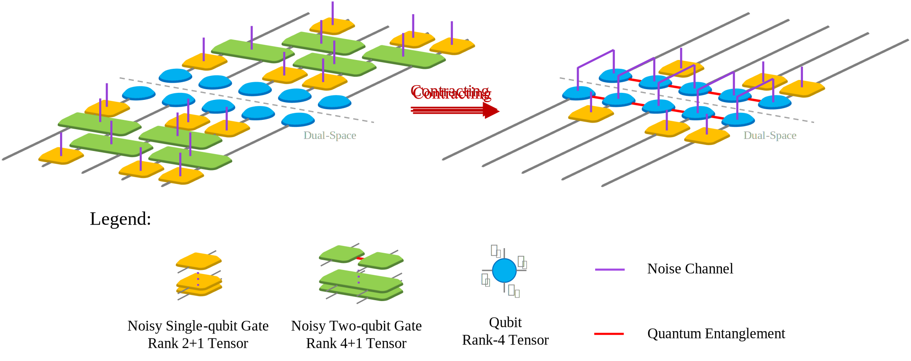

# Quantum circuit simulator with Matrix Product Density Operator (MPDO)

###### I have to emphasize that this project is not intended for High Performance Computing

## Computer Implementation
Main Packages Required:
- TensorNetwork -- Latest Version
- Pytorch -- Version 2.0 or Version 1.10

### TensorNetwork Package

Project is based on TensorNetwork, a mathematical technique that could do truncation to speed
up the calculation with limited error, which is introduced by SVD.

Package I used is TensorNetwork, which is a python package for tensornetwork calculations
from [google](https://github.com/google/TensorNetwork). This package gets multiple backends
like Jax, Pytorch, Tensorflow, Numpy, etc. However, and is in alpha version, and 
stopped updating since 2021. I adopt backend as pytorch with setting 
    ```
    tensornetwork.set_default_backend("pytorch")
    ```

Problems may raise when using this package, codes fixes are involved by myself. I use this package
because of its simplicity and easy to read (actually this is the first package I know from NEW
Bing, and I just don't want to learn others, I am not good at coding). Problems like,

1. Axis_names and edge_names are not consistent, which may cause bugs like in SVD (Interestingly
, edges name won't change after operation like CONTRACT, so I wrote function tools.EdgeName2AxisName
to keep axis_names is right);
2. Some backends are out of date, like torch.svd and torch.qr are substituted by 
torch.linalg.svd and torch.linalg.qr, and may causes bug while .linalg.svd return vh, which
is the transpose and conjugate of v, but .svd return v directly;
3. ...

Certainly, there are packages under maintenance,
- [TeNpy](https://github.com/tenpy/tenpy): A package developed by physicist, it provides
many useful algorithm like DMRG/TEBD, but it is not easy to use(for me);
- [ITensor](https://itensor.org/): If you're familiar with C++ or Julia, ITensor is a good
choice to accomplish the target.
- You might just create a package with different backend, use backend.einsum() to make 
calculation.

<span style="color:red">
For all, author(me) is not familiar with both C++ and TensorNetwork coding, so I choose
the simplest one as a startup. Once the MPS-MPO-MPDO simulator is necessary for me and my
team, I might consider coding it with CPP with a faster contracting and controlling. Let it
be known that ** ITensor does not support its CPP package **.
</span> 


**Attention:**
1. While you're trying to use spilt_node(svd or qr), be careful about the axis_names, which
is involved in the calculation of the SVD/QR with left_edges and right_edges, I wrote some
strategy to make sure it is right, but might be ugly, and some of them are abolished.
2. I set **Nodes** as qubits, which can be easily operated and more intuitive to understand.
However, in some theory, people believe that **Edges** are qubits, which is more suitable.
3. Python Class tensornetwork.Node or tensornetwork.AbstractNode is physical entity in 
computer memory, so that operations to qubits can be done without given a new memory space,
which saves memory and easy to code in implementation.

### Qubit
Qubit is a basic unit in quantum computing, which is a two-level system. In this project,
I use tn.Node or tn.AbstractNode as qubit, whose rank is changeable with contraction.

**Attention:** Axis_names is an important property in TensorNetwork Package, which is a list
in python, it easily makes mistakes. I designed it for qubit/tensor in picture below for a 
general high-rank situation in current model of quantum computing.

<p align="center">

</p>

Noticed that the indices name is explicit with number of qubit, for 1st qubit, it has name in pic.


### Quantum Gate
Quantum Gates are generally defined as a matrix, but in tensornetwork it is treated as tensor,
which is a generalization of matrix. From intuition, single-qubit gate like 'X' is a 2x2 matrix,
which can be represented as a (2, 2) rank-2 tensor, and multi-qubit gate like 'CNOT' is a 4x4 
matrix which can be represented as a (2, 2, 2, 2) rank-4 tensor. 

I make a Class called TensorGate() in file basic_gate.py, it contains some basic quantum gates
with property, like name, tensor, rank, shape, axis_names, etc. 

**Attention:** Axis_names is an important property in TensorNetwork Package, which is a list
in python, it easily makes mistakes. I designed it for gates/tensors in picture below, and
it's easy to be generalized to many-qubit gates.

<p align="center">

</p>

Currently, I provided basic gates as: ['X', 'Y', 'Z', 'H', 'S', 'T', 'RX', 'RY', 'RZ', 'U1', 'U2',
'U3', 'U', 'CNOT', 'CZ', 'SWAP', 'RZZ']. Their tensor form is formed with function 
**torch.reshape()**, except CNOT, which tensor is derived from its truth table.

## Physics Implementation

Adding quantum gates to qubits is the basic operation in quantum computing, and it's naturally
to be show in tensornetwork form like picture below.

<p align="center">

</p>

Quantum entanglement between qubits is the key to quantum computing, it's introduced by many-
qubit gates, it gives qubit/tensor a new leg to survive. The main idea to use tensornetwork to 
represents the quantum circuit is its contraction strategy. While people are spectating the result
of a quantum circuit, it gives a probability distribution but not a series of nodes. Hence, the
exponential disaster appear when people are trying to contract all the operated nodes together.
Tensornetwork provide a series of contraction algorithms like DMRG, whose main idea is utilizing
SVD function's truncation to speed up the calculation. Therefore, the implementation of adding 
quantum gates here, I take strategy below to limit the dimension of bond between entangled 
qubits.
1. Do a local optimal approximation on inner indices by SVD, which is (this part is introduced
by quantum noise, and I'll show it later).
```math
    T_{l_k, r_k}^{s_k, a_k} = \sum_\mu U^{s_k, \mu}_{l_k, r_k} S_\mu V_{\mu, a_k}
```
Keep $\kappa$ largest singular values $S_\mu$ after a layer of noise.

2. Apply QR-decomposition on each Tensor from left to right (which forms a canonical form of MPO),
```math
    T_{l_k, r_k}^{s_k, a_k} = \sum_\mu Q^{s_k, a_k}_{l_k, \mu} R_{\mu, r_k}
```
Except the rightest tensor, all other tensors got left-orthogonalized.

3. Apply SVD from right to left to truncate each of the bond indices,
```math
    \sum_ {l_ {k+1}} T_ {l_k, l_ {k+1}}^{s_k, a_k} T_ {l_ {k+1}, r_ {k+1}}^{s_ {k+1}, a_ {k+1}}\approx 
    \sum_ {\mu=1}^{\chi} U^{s_k, a_k}_ {l_k, \mu} S_\mu V_ {\mu, r_ {k+1}}^{s_ {k+1}, a_ {k+1}}
```

<span style="color:blue">
The most economical way is first to complete a layer of two-qubit gates and noise, then
to perform step 2&3.
</span>

## Mathematical Implementation
Generally, in matrix operation, if a double-qubit gate was applied to qubits that are stepping
over qubits, SWAP gates(or just permute) operation are needed to control the matrix elements.
However, in tensornetwork, it's not necessary to do so, because the tensor form of quantum gates
is spanning in subspaces with "legs", we could just choose the right legs to contract with the 
qubits, it works directly without any permutation.

<p align="center">

</p>

And the entanglement are naturally to be spread between qubits with following operations.

# Inplementation of Quantum Noise
## United Theoretical Noise Model
Quantum noise is a sophisticated topic in quantum physics, in quantum computation, it can
be roughly divided into several types/channels, like amplitude damping, phase damping, which
is shown in picture below,

<p align="center">

</p>

Detailed quantum noise simulation or noise channels can be easily found in books or papers,
like QCQI, Nielsen, etc. I implemented quantum noise easily with the strategy like the
**Actual circuit** in picture, which is important is that in double-qubit gate, the **DC** 
is only applied to the **target qubit**, besides, **SPAM** is not implemented, because 
of a low probability.

## Real Noise (based on Experimental Data - $\chi$ Matrix)

A **TRUE** quantum noise simulation function with the QPT-Chi matrix on **REAL** quantum
computer CZ-gate is provided. A real quantum noise takes places in actual physical
control of the superconducting qubits, two examples are shown in picture below,

<p align="center">

</p>

You might be curious of the pulse-controlled quantum computing system, a sketch is shown below,

<p align="center">

</p>

# Structure of the Project

- main: Test file for the project, passed while the environment is set up correctly.

**Library**:
- AbstractGate: Introduces an abstract class of quantum gates;
- ADCircuits: Provides a class of quantum circuit with multiple methods, like add_gate;
- ADGate: Provides basic information of quantum gates;
- chipInfo: Provides basic information of quantum chips(Mainly used for noise simulation);
- ElderFunc: Original codes in previous versions;
- NoiseChannel: Provides noise channel for quantum circuit;
- TNNOptimizer: Provides a class of optimizer for tensornetwork algorithm;
- tools: Introduces a set of tools for implementing operations for inside program or outer program.

# Tutorial

[Basic API Tutorial](https://colab.research.google.com/drive/1Fp9DolkPT-P_Dkg_s9PLbTOKSq64EVSu)

## Initialize Program
```python
import tensornetwork as tn
import Library.tools as tools
from Library.ADCircuits import TensorCircuit
from Library.AbstractGate import AbstractGate

tn.set_default_backend("pytorch")
```

## Basic Information of Quantum Circuit
```python
qnumber = 4
ideal_circuit = False   # or True
realNoise = True	# or False
chiFilename = './data/chi/chi1.mat'
chi, kappa = None, None

"""
While ideal_circuit is False, simulator is working with a noisy quantum circuit with United Noise Model;
      realNoise is True, double-qubit gate is replaced by a real quantum gate with QPT-Chi matrix decomposition;
      
      chiFilename is the path of QPT-Chi matrix, which is used for real quantum noise simulation;
        I provided two chi matrix in ./data/chi, 'chi1.mat' is for noise qubit,
                                                 'ideal_cz.mat' is ideal cz-gate chi matrix;
      
      chi is used for truncating the dimension between qubits in TNN_optimization process, accelerating the contraction;
      
      kappa is used for truncating the inner dimension between qubit-conj_qubit in contracting MPDO->DensityMatrix,
        let it be know that the KEY point in MPDO method is its representation of noise, while kappa=1, noise information
        is aborted, which means the so-called noise-simulation is not working exactly.
        
An ideal=True circuit cannot work with realNoise=True,
"""
```

## Establish a Quantum Circuit
```python
# Establish a quantum circuit
circuit = TensorCircuit(ideal=ideal_circuit, realNoise=realNoise,
                        chiFilename=chiFilename, chi=chi, kappa=kappa)
"""
Example:
    q[0] ----[H]----[CONTROL     ---------------------[X]----
    q[1] ----[X]----         NOT]----[CONTROL     ----[H]----
    q[2] ----[H]----[CONTROL     ----         NOT]----[X]----
    q[3] -----------         NOT]---------------------[X]----
"""

# layer1
circuit.add_gate(AbstractGate().h(), [0, 2])
circuit.add_gate(AbstractGate().x(), [1])
# layer2
circuit.add_gate(AbstractGate().cnot(), [0, 1])
circuit.add_gate(AbstractGate().cnot(), [2, 3])
# layer3
circuit.add_gate(AbstractGate().cnot(), [1, 2])
# layer4
circuit.add_gate(AbstractGate().x(), [0, 2, 3])
circuit.add_gate(AbstractGate().h(), [1])

```
## An Initial Quantum State
```python
"""
In tools.py, I provide several initial state like,
        |00..00>: create_ket0Series(qnumber)        |11..11>: create_ket1Series(qnumber)
        |++..++>: create_ketPlusSeries(qnumber)     |--..--> create_ketMinusSeries(qnumber)
    Or a random/wanted state with,
        |**..**>: create_ketRandomSeries(qnumber, tensor)
Certainly, people can input an arbitrary state with 
        list[tensornetwork.Node] or list[tensornetwork.AbstractNode]
"""

initState = tools.create_ket0Series(qnumber)
```

## Calculate Ket-space and Density Matrix $\rho$
```python
"""
State returns a state vector for pure quantum state, or a density matrix.

    Args:
     	state_vector: bool, if True, return a state vector, else return a density matrix.
     	reduced_index: list, calculate the reduced density matrix with the given index qubit is reduced.
"""

state = circuit(state, state_vector=False, reduced_index=[])
```

# Problems may be encountered
**VQA** is not supported in this version, bugs still exist in the implementation of forward()
and updating the parameters.

**RealNoise** function is still sensitive, which causes a little bit high noise compare to
QUTIP-fullMatrix simulation.